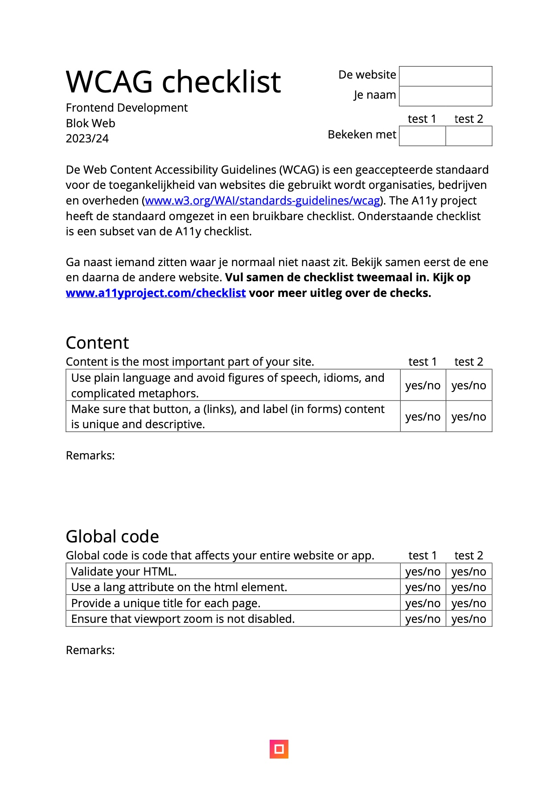
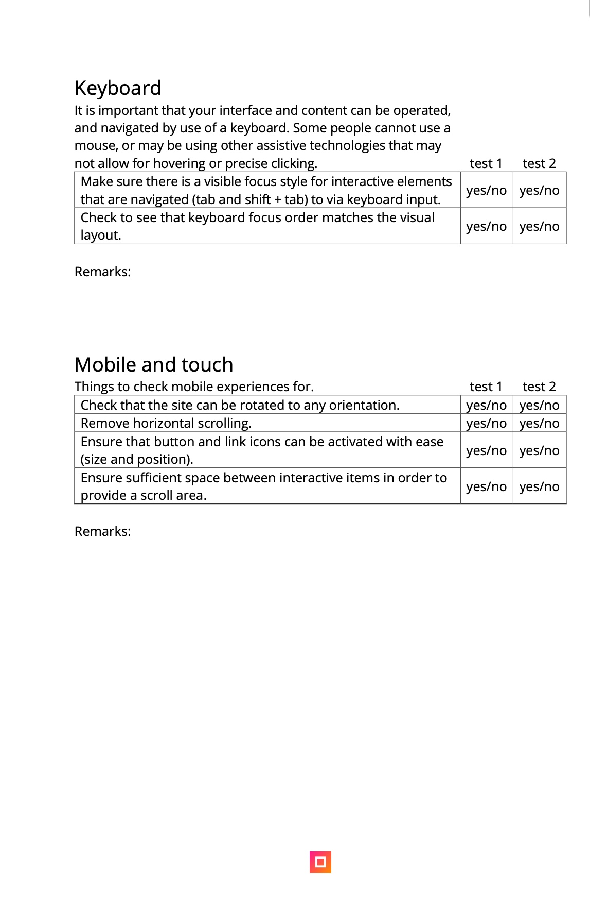
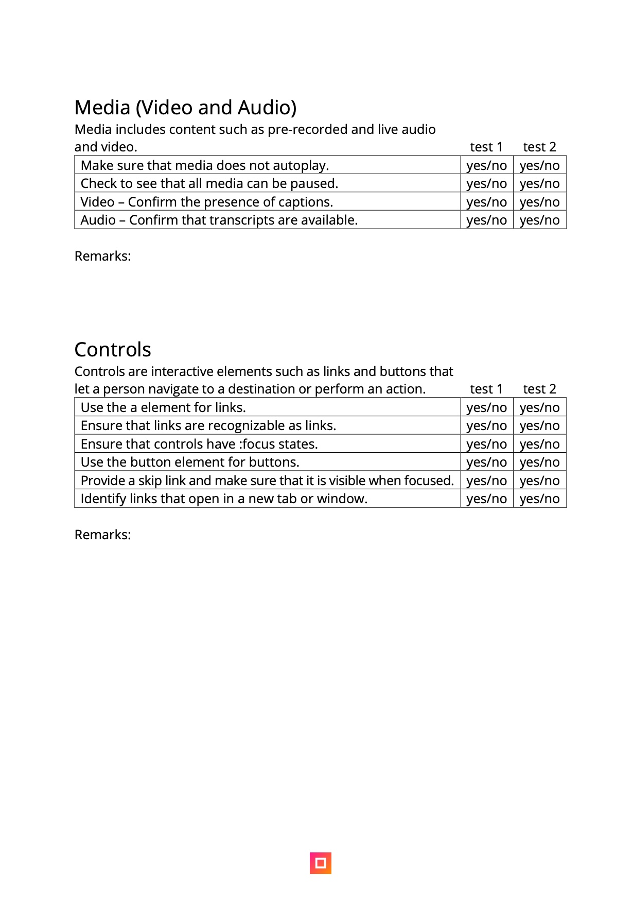
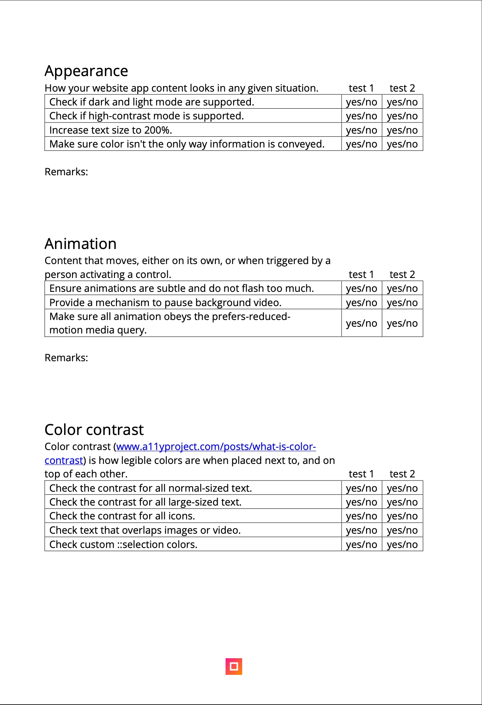
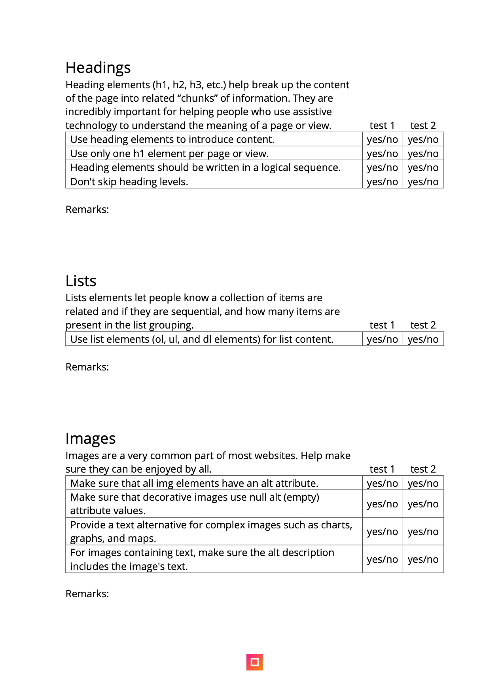
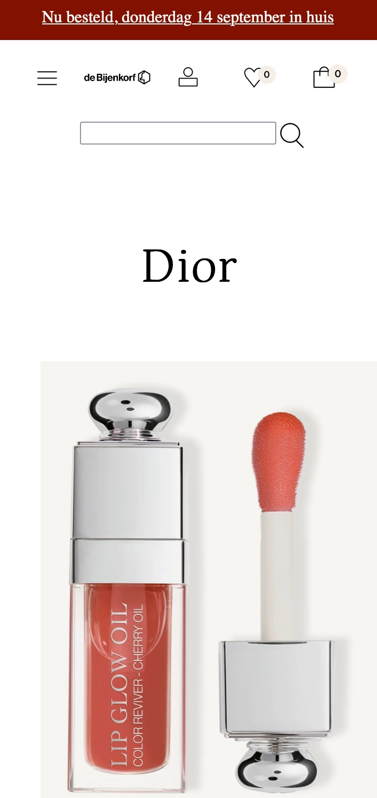
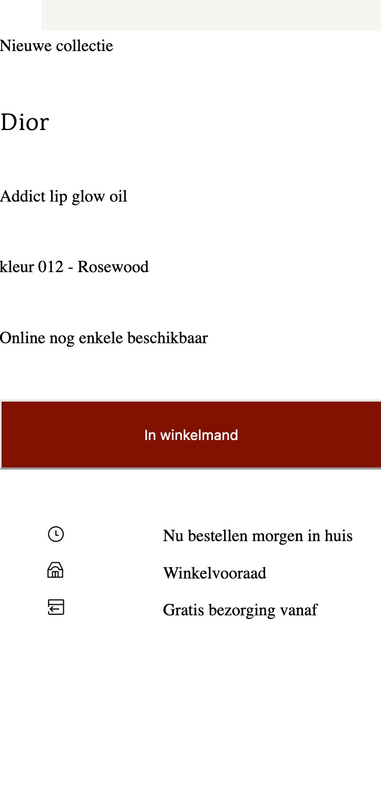
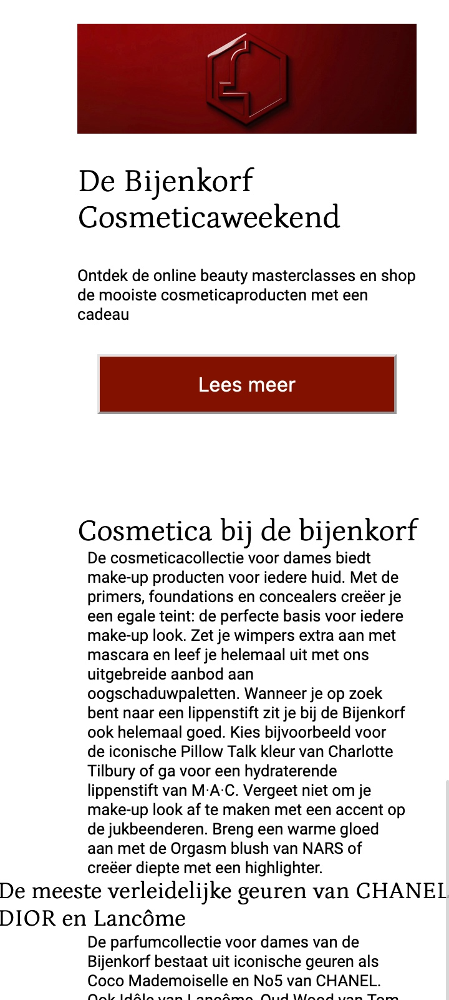
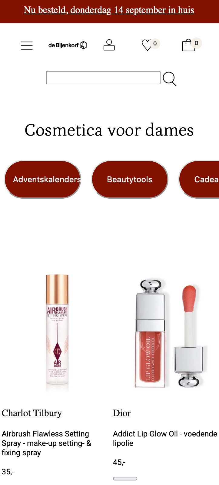
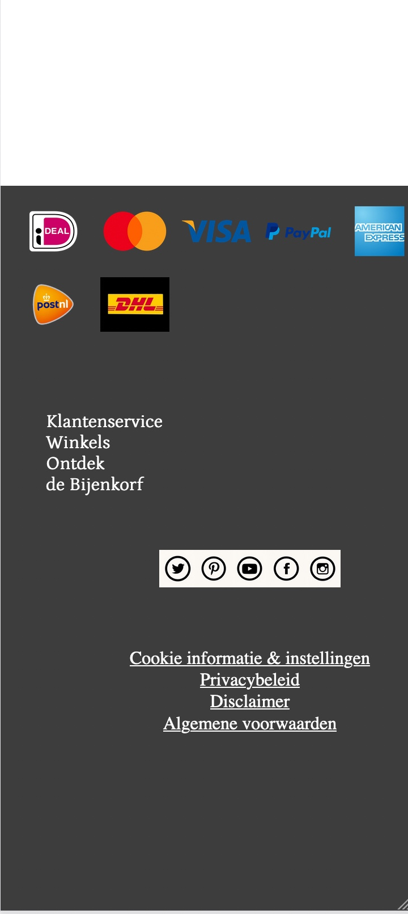

# Procesverslag
Markdown is een simpele manier om HTML te schrijven.  
Markdown cheat cheet: [Hulp bij het schrijven van Markdown](https://github.com/adam-p/markdown-here/wiki/Markdown-Cheatsheet).

Nb. De standaardstructuur en de spartaanse opmaak van de README.md zijn helemaal prima. Het gaat om de inhoud van je procesverslag. Besteedt de tijd voor pracht en praal aan je website.

Nb. Door *open* toe te voegen aan een *details* element kun je deze standaard open zetten. Fijn om dat steeds voor de relevante stuk(ken) te doen.

## Jij

  
uitwerken voor kick-off werkgroep

  ### Auteur:
  Tao Tao Douven

  #### Je startniveau:
  Blauw en als ik tijd heb rood.

  #### Je focus:
  Responsive. 
 

## Je website

  
uitwerken voor kick-off werkgroep

  ### Je opdracht:
  https://www.debijenkorf.nl/damesmode 

  #### Screenshot(s) van de eerste pagina (small screen): 
  Pagina van overzicht cosmetica dames  
  

  #### Screenshot(s) van de tweede pagina (small screen):
  Pagina van detail op een cosmetica product  
  
 

## Toegankelijkheidstest 1/2 (week 1)

  
uitwerken na test in 2e werkgroep

  ### Bevindingen
  Lijst met je bevindingen die in de test naar voren kwamen:

  
  
  
  
  

  Content:
  - Er zitten veel fouten in mijn html code.

  Keyboard:
  - Alles no, omdat ik nog niet met keyboard accesability bezig ben geweest.

  Mobile touch:
  - Nog niet rekening gehouden met horizontal scrolling.
  - Plaatsing van links nog niet goed.

  Headings:
  - Alles goed.

  List:
  - Alles goed.

  Images:
  - Nog niet rekening gehouden met attribute values.

  Media:
  - Nog niet van toepassing.

  Controlls:
  - Links zijn nog niet reconisable als links.
  - Controls hebben geen :focused state.
  - Heb geen skip links.

  Appearence:
  - Ik heb geen light/dark mode.
  - High contrast mode is niet gesuport.
  - Text kan je niet tot 200% doen.

  Animatie:
  - Nog niet van toepassing.

  Color contrast:
  - Bij sommige foto's is er sprake van text overlapping. 

## Breakdownschets (week 1)

  
uitwerken na afloop 3e werkgroep

  ### de hele pagina: 
  

  ### dynamisch deel (bijv menu): 
  

  ### wellicht nog een dynamisch deel (bijv filter): 
  

## Voortgang 1 (week 2)

  
uitwerken voor 1e voortgang

  ### Stand van zaken
  hier dit ging goed & dit was lastig (neem ook screenshots op van delen van je website en code)

 Ik ben in week 1 begonnen met eerst de navigatie balk te maken. Toen heb ik flexbox gebruikt om de list itemns naast elkaar en ruimte 
tussen elkaar te plaatsen. Dat lukte eerst niet omdat ik niet de juiste parents en childrens heb aangesproken. Nadat ik dat wel 
had gedaan is het gelukt. Het lukt mij niet om het midden stuk met alle cosmetica itemns naast elkaar in rijen te plaatsen. Ik probeerde 
met flex de itemns goed naast en onder elkaar te krijgen, maar het lukte alleen om de binnen de itemns zelf de foto en de tekst goed onder 
elkaar te plaatsen. 

Ik ga nu aan de slag met grid. Ik doe display grid op de body en maak 2 columns (voor in de main bij de filter optie en de cosmetica itmens) en maak 3 rows (voor de header, de filter + cosmetica itemns en de navigatie).  

Soms werkte sommige styles die ik in de css heb aangegeven niet, maar dat kwam omdat ik de verkeerde css selector had gebruikt of 
het verkeerde element had geselecteerd. Door itemns achtergrond kleur te geven kon ik zien hoeveel ruimte het in beslag nam en waar hij stond. 

Door een schema te tekenen met hoe ik de grid binnen elk onderdeel wil hebben, kon ik heel makkelijk en georganiseerd itemns op de 
juiste manier plaatsen binnen grids. 

Ook heb ik boven elk stukje css commands gezet met waarvoor de code bedoeld is om overzicht te geven. En heb ik met commands 
aangegeven binnen de css welke styling voor de body, header, main en footer bedoeld zijn. Dit hielp mij om code sneller terug te vinden. 

De rows in de grid namen waaren allemaal te hoog. ik had margin: 0; en padding:0; gebruikt maar dat werkte niet. Na het opzoeken op het internet kwam ik erachter dat je hight: fit-content; kunt gebruiken om ervoor te zorgen dat de hoogte de ruimte van de content inneemt. Nu was de header goed, maar body neemt teveel ruimte in. Door de parents een specifieke height te geven is het gelukt. 

De eerste pagina heeft een goed structuur en ga nu door naar begin maken van tweede pagina.

De pagina van de index.html werkte niet meer. Ik denk dat ik komt omdat ik de footer en header allebei de klassen heb gegeven en een van de twee pagina's de verkeerde class naam heb gebruikt. En uiteindelijk in de inspector kwamen de stijlen van de footer en header niet bij de inspector. die twee klasses bij het stijlen weg gehaalt en alles werkt. Nu staat de footer bij index.html staat niet goed, maar footer diorlipoil.html wel.

height op footer main header weg halen, kijken wat het probleem is. 

  ### Agenda voor meeting
  samen met je groepje opstellen

  | student 1      | student 2          | student 3    | student 4        |
  | ---            | ---                | ---          | ---              |
  | dit bespreken  | en dit             | en ik dit    | en dan ik dat    |
  | en dat ook nog | dit als er tijd is | nog een punt | dit wil ik zeker |
  | ...            | ...                | ...          | ...              |

  ### Verslag van meeting
  hier na afloop snel de uitkomsten van de meeting vastleggen

  - punt 1
  - punt 2
  - nog een punt
  - ...

## Voortgang 2 (week 3)

  
uitwerken voor 2e voortgang

  ### Stand van zaken
  hier dit ging goed & dit was lastig (neem ook screenshots op van delen van je website en code)

  Ik ga in week 3 begin nu bezig met media queries om elk verschillend grote scherm anders te stijlen. Daarna ga ik nog een nav, karosel, maken die je navigeert door de pagina heen     waar je je op het moment plaats vind, met behulp van een form en input checkbox. 
  
  In de footer staat van de tekst rijen de tweede rij niet netjes onder elkaar. Waarschijnlijk wordt hij gestyled door andere code en hierdoor heb ik hem een display:block; gegeven     zodat hij wel goed staat.  
  
  Voor het karosel, navigatie, bij de main in cosmeticapagina zijn bij de "buttons" de pijltjes als je hem in en uit klikt hetzelfde. Ik ga dat veranderen door dat als je de lijst      uit klikt het pijltje naar boven wijst zodat het duidelijk word dat je hem weer terug kan klappen. Met deze video heb ik de button met een image gestijlt:                     https://dlo.mijnhva.nl/d2l/le/content/437009/viewContent/1483500/View           
  

  ### Agenda voor meeting
  samen met je groepje opstellen

  | student 1      | student 2          | student 3    | student 4        |
  | ---            | ---                | ---          | ---              |
  | dit bespreken  | en dit             | en ik dit    | en dan ik dat    |
  | en dat ook nog | dit als er tijd is | nog een punt | dit wil ik zeker |
  | ...            | ...                | ...          | ...              |

  ### Verslag van meeting
  hier na afloop snel de uitkomsten van de meeting vastleggen

  - punt 1
  - punt 2
  - nog een punt
- ...

## Toegankelijkheidstest 2/2 (week 4)

  
uitwerken na test in 9e werkgroep

   
  
  
  
  

  ### Bevindingen
  Lijst met je bevindingen die in de test naar voren kwamen (geef ook aan wat er verbeterd is):

Content:
  - Er zitten geen fouten meer in mijn html code.

  Keyboard:
  - Alles is nogsteeds no, omdat ik nog niet met keyboard accesability bezig ben geweest.

  Mobile touch:
  - Nu ook nog niet rekening gehouden met horizontal scrolling.
  - Plaatsing van links nogsteeds niet goed.

  Headings:
  - Alles goed.

  List:
  - Alles goed.

  Images:
  - Hier ook weer nog niet rekening gehouden met attribute values.

  Media:
  - Niet van toepassing.

  Controlls:
  - Links zijn nog niet reconisable als links.
  - Controls hebben geen :focused state.
  - Heb geen skip links.

  Appearence:
  - Ik heb geen light/dark mode.
  - High contrast mode is niet gesuport.
  - Text kan je niet tot 200% doen.

  Animatie:
  - Nog niet van toepassing.

  Color contrast:
  - Bij sommige foto's is er sprake van text overlapping.
    

## Voortgang 3 (week 4)

  
uitwerken voor 3e voortgang

  ### Stand van zaken
  hier dit ging goed & dit was lastig (neem ook screenshots op van delen van je website en code)

Ik ga nu tijdens de laatste week van de eerste les werken aan media queries. Ik begin met telefoon groote. Ik heb ook alle grootes van de media queries van px veranderd naar em. Het lukt me nog niet goed om de navigatie goed te stylen dus ik ga ze achtergrond kleuren geven om voor duidelijkheid te zorgen. 

Ik ben ook ondertussen nog bezig met de plaatsing van de elementen bij de tweede pagina en merk dat de elementen heel veel ruimte innemen en dat komt omdat ze automatisch de ruimte nemen die ze hebben https://css-tricks.com/exploring-the-complexities-of-width-and-height-in-css/#:~:text=Block%20elements%20include%20any%20element,%3E%20%2C%20and%20so%20many%20more.

Herkansing: Ik heb het niet gehaald om het vak gelijk te halen dus moet ik hem herkansen. Ik begin eerst met het valideren van mijn html en css. 
IK ben er achter gekomen dat ik een hoop fouten heb in mijn html code dus heb alle fouten eruit gehaald. Door de verandering in de html code,
klopt sommige css code niet en heb ik deze ook aangepast waar nodig. 

Beginnen met iphone groote media querie maken. gebruik dezer website om afmetingen te zien: https://www.freecodecamp.org/news/media-query-css-example-max-and-min-screen-width-for-mobile-responsive-design/
De media querie werkt niet en heb deze video gekeken 
https://www.google.com/search?q=media+queries+not+working&client=safari&sca_esv=576523393&rls=en&biw=1470&bih=840&tbm=vid&ei=wjM5ZbHdMpvr7_UP3-2WgAk&oq=media+queries+not+wor&gs_lp=Eg1nd3Mtd2l6LXZpZGVvIhVtZWRpYSBxdWVyaWVzIG5vdCB3b3IqAggAMgUQABiABDIFEAAYgAQyBhAAGBYYHjIGEAAYFhgeMgYQABgWGB4yBhAAGBYYHjIGEAAYFhgeMgYQABgWGB4yBhAAGBYYHjIGEAAYFhgeSMcQUABYsglwAHgAkAEAmAFMoAGbBKoBATi4AQHIAQD4AQGIBgE&sclient=gws-wiz-video#fpstate=ive&vld=cid:a28c8451,vid:acqN6atXVAE,st:0. 
Heb de code onder aan gezet en deed nogsteeds niet. Ik had er geen media type en heb dat nu wel gedaan. Ook gebruikte ik max-width en dan moet 
de volgorde van grootste naar kleinste scherm staan in de css code. Hierdoor werkte de media queries wel. 

In de navigatie word de link dames vervangen door een hamburger menu. Met psuedoclass ::before voeg ik via content een afbeelding toe. 
Plus met visebility. Bij de kleinere schermen zijn er buttons om te filteren ipv een tweede navigatie. Je kan niet met ::after een button toevoegen 
met css aan de html dus heb ik extra buttons aan de html gegeven en die bij de schermen waar ze niet nodig zijn niet zichtbaar gemaakt 
met display:none. 

Ik wil ook een zoekicoontje achter de search bar plaatsen (dmv ::after )maar dat lukt nog niet helemaal. Dat komt omdat dat niet mogelijk 
o.a door input field geen container is https://www.geeksforgeeks.org/how-to-use-before-or-after-pseudo-element-to-an-input-field-in-css/#:~:text=Note%3A%20We%20cannot%20use%20%3A%3A,style%20to%20each%20of%20them.
https://dev.to/erhannah/adding-pseudoelements-on-input-elements-5bdk ik voeg een span toe aan de li waar de input zit als oplossing. 
Dit werkt. Deze li geef ik display:flex en align itemns center zodat de input en span naast elkaar komen te staan. Voor flex uitleg:
https://css-tricks.com/snippets/css/a-guide-to-flexbox/. 

De buttons voor filteren in de kleine schermen kun je horizontaal scrollen en heb deze video gebruikt voor uitleg over hoe dat moet: 
https://www.youtube.com/watch?v=3yfswsnD2sw. 

Week voor inleveren herkansing: 
Ik kwam ook deze video tegen van over responsive lay-out https://www.youtube.com/watch?v=VQraviuwbzU. Hier word uitgelegd hoe je zo handig 
mogelijk een responsive lay-out kunt coderen met allerlei tips. Ik merkte zelf al dat ik te veel code aan het herhalen was met media 
queries en het niet de juiste manier was. Ik ga nu met deze tips zo min mogelijk code te herhalen. Ook geen fixed sizes gebruiken. 

Ook kwam ik er achter dat de grid op de body niet werkte. Nu staat er wel een grid op de body die bestaat uit drie rows: header, main en footer.
Doordat er een grid op de body zit staat de navigatie balk in de header niet goed en moet ik uitzoeken hoe ik dit kan oplossen. 
Alleen de header staat nu verkeerd, de andere elementen staan hetzelfde. Ik heb uiteindelijk geen grid op de body gezet omdat dat eigenlijk 
niet echt nodig is en het niet goed werkt voor de header. 

Omdat ik nu mobile first codeer dacht ik dat het handig was om de link van dames te vervangen voor een hamburger menu afbeelding, 
omdat dat word gebruikt bij mobile first. Ik wilde dan een ::before aan de afbeelding toevoegen met een link van dames en de 
afbeelding zelf dan hidden maken, maar je kunt geen link toevoegen. Ik kan dan of houden wat ik voorheen had (een link in de html
en ::before waarbij een hamburger menu word toegevoegd), of in de html een afbeelding en een link en dan bij mobile de afbeelding 
zichtbaar maken en bij grotere schermen de link zichtbaar maken. Ookal is het volgensmij makkelijker om voor de eerste optie te gaan,
is het denk ik meer semantisch correct om voor de tweede optie te gaan. 

Ik wilde meer leren over web accesability en heb daarom deze video bekeken https://www.youtube.com/watch?v=qr0ujkLLgmE. Het gaat hier 
over visual disibility, motor disibility, cognitif disibility, animation, ARIA roles en light/dark mode. Door de video weet ik een stuk 
beter hoe ik mijn website meer accesable kan maken. 

Om hier een begin aan te maken, start ik met te werken aan color contrast. Ik gebruik deze color contrast checker
https://accessibleweb.com/color-contrast-checker/. Ik heb de navigatie en de footer zwart gemaakt met witte tekst en de buttons donker rood 
met witte tekst. Verder heb ik alle tekst op witte achtergrond zwart gemaakt ipv grijs. 

Ook is het het best om geen tekst op je afbeeldingen te hebben voor accesability. Bij een aantal afbeeldingen die ik van de orginele bijenkorf 
website heb, bevatten tekst. Ik heb met Adobe photoshop de tekst eruit geshopt en die foto's vervangen voor de foto's met tekst. 
Tevens zijn de betaal icoontjes in de footer screenshots van de orginele website en bevatten een beige achtergrond. Het contrast tussen 
die beige achtergrond en de icoontjes is te laag, en hierdoor heb ik het beige er zorgvuldig uit geshopt en uiteraard weer de nieuwe foto's
vervangen voor de oude. Alle foto's waren jpeg's en geen png dus die heb ik omgezet naar png's. 

Nu ga ik een light en dark modus maken voor de website. Dit doe ik met hulp van deze video https://www.youtube.com/watch?v=_yCgeXFAXTM. 
De dark modus heb ik gemaakt met een media queries en was makkelijk om te maken. 

Onder mijn footer zit er heel veel wit ruimte en ik denk dat dat komt door de margin:0; voor * in de css, want als ik die uitzet dan is die 
ruimte onder de footer weg. 

Ik ga nu de tweede navigatiebalk verder stylen om te filteren. Met hulp van de docent en later deze video https://www.youtube.com/watch?v=8QKOaTYvYUA&t=2028s ga ik de filter balk maken. Ik had hem al wel eerder gemaakt, maar heb hem nog niet gestyled met css.
Ik wil dat deze code werkt: 

.cosmeticapagina main nav ul li:nth-child(3) form label input[type="checkbox"]:checked ~ ul{
	display: block;
} 

want zo kan ik de lijst laten zien wanneer je op de checkbox clicked, maar het werkt niet en ik weet niet waarom. Deze code: 
.cosmeticapagina main nav ul li:nth-child(3) form label input[type="checkbox"]:checked  werkt wel dus het komt denk ik doordat ik de 
lijst niet goed selecteer. Deze website heeft me geholpen te begrijpen waarom het selecteren niet lukte 
https://stackoverflow.com/questions/65330346/is-there-a-css-selector-i-can-use-to-show-an-element-once-a-checkbox-is-selected. 
Ik heb om het probleem op te lossen de ul (lijst) binnen de label te plaatsen waar de input ook is en met general sibling selector 
de ul geselecteerd. De ul was nog geen general sibling van de input en nu wel. Ik heb deze website gebruikt om meer te weten te komen over 
clip path: https://css-tricks.com/almanac/properties/c/clip-path/. 

Ik heb de code van de index.html door de validator gehaald en er zijn veel errors uit gekomen, die ga ik er allemaal uithalen. Een daarvan is dat een h2 geen child element van een label. Dus de h2 moet ik eruit halen maar daardoor heb je niet meer dat als je op de h2 klikt dat de list open klapt. In de label schrijf ik daarom de titel van de filter optie ipv een h2. Nu kan ik niet meer de h2:after gebruiken om de afbeelding van het pijltje achter de titel van de filter te krijgen. Hiervoor ga ik nu een span gebruiken. Nu heb ik ook niet het probleem dat ik heel veel css moet schrijven voor de h2:after = 	 /*karosel h2 pijltje toevoegen*/
.cosmeticapagina main nav ul li:nth-child(3) h2:after, li:nth-child(4) h2:after, li:nth-child(5) h2:after, li:nth-child(6) h2:after, li:nth-child(7) h2:after, li:nth-child(8) h2:after, li:nth-child(9) h2:after, li:nth-child(10) h2:after, li:nth-child(11) h2:after{
  content: "";
	position: relative;
	right: 0;
  background-image: url(../images/pijltjenaarbeneden.png);
	width: 2em;
	height: 1em;
	background-size: 1em;
	display: inline-block;
	background-repeat: no-repeat;
}
Nu kan ik deze code gebruiken: 

js gebruiken: https://developer.mozilla.org/en-US/docs/Web/API/Document/querySelector. 

Ik ga aria's toevoegen aan mijn html. Ik heb aria's aan buttons, input en meer toegevoegd. Ook als er op een link focus is heb ik die zwart gekleurd zodat het contrast goed is. https://webdesign.tutsplus.com/keyboard-accessibility-tips-using-html-and-css--cms-31966a. https://www.youtube.com/watch?v=38JDscMbB4I. 

Omdat ik rekening wilde houden met dark modus had ik de kleuren van de website veranderd, maar bij nadere inzien ga ik dit toch weer wat meer terug brengen naar minder heftigere kleuren die wel nog genoeg contrast hebben. De website zal er dan hopelijk iets estetischer en minder druk uitzien dan voorheen. 

  ### Agenda voor meeting
  samen met je groepje opstellen

  | student 1      | student 2          | student 3    | student 4        |
  | ---            | ---                | ---          | ---              |
  | dit bespreken  | en dit             | en ik dit    | en dan ik dat    |
  | en dat ook nog | dit als er tijd is | nog een punt | dit wil ik zeker |
  | ...            | ...                | ...          | ...              |

  ### Verslag van meeting
  hier na afloop snel de uitkomsten van de meeting vastleggen

  - punt 1
  - punt 2
  - nog een punt
  - ...

## Eindgesprek (week 5)

  
uitwerken voor eindgesprek

  ### Je uitkomst - karakteristiek screenshots:
  
  
  
  
  
  

  ### Dit ging goed/Heb ik geleerd: 
  Ik vond dat ik de footer wel goed heb gemaakt en dat dat mij best goed af ging. Ik heb hier heel erg geleerd hoe je grid moet gebruiken en gebruik grid nu best vaak voor positioneren.
  
  

  ### Dit was lastig/Is niet gelukt:
  De filter buttons accesabel te maken. Je kunt door de buttons heen door te scrollen, maar dat is niet accesable voor iedereen en weet ook niet hoe ik dat kan doen. 
  Dit is overegens wel hoe het bij de bijenkorf website ook is gedaan. 

  

## Bronnenlijst

  
continu bijhouden terwijl je werkt

  Nb. Wees specifiek ('css-tricks' als bron is bijv. niet specifiek genoeg). 
  Nb. ChatGpT en andere AI horen er ook bij.
  Nb. Vermeld de bronnen ook in je code.

  1. https://dlo.mijnhva.nl/d2l/le/content/437009/viewContent/1483500/View
  2. https://css-tricks.com/exploring-the-complexities-of-width-and-height-in-css/#:~:text=Block%20elements%20include%20any%20element,%3E%20%2C%20and%20so%20many%20more.
  3.  https://www.freecodecamp.org/news/media-query-css-example-max-and-min-screen-width-for-mobile-responsive-design/
  4.  https://www.google.com/search?q=media+queries+not+working&client=safari&sca_esv=576523393&rls=en&biw=1470&bih=840&tbm=vid&ei=wjM5ZbHdMpvr7_UP3-2WgAk&oq=media+queries+not+wor&gs_lp=Eg1nd3Mtd2l6LXZpZGVvIhVtZWRpYSBxdWVyaWVzIG5vdCB3b3IqAggAMgUQABiABDIFEAAYgAQyBhAAGBYYHjIGEAAYFhgeMgYQABgWGB4yBhAAGBYYHjIGEAAYFhgeMgYQABgWGB4yBhAAGBYYHjIGEAAYFhgeSMcQUABYsglwAHgAkAEAmAFMoAGbBKoBATi4AQHIAQD4AQGIBgE&sclient=gws-wiz-video#fpstate=ive&vld=cid:a28c8451,vid:acqN6atXVAE,st:0.
  5.  https://www.geeksforgeeks.org/how-to-use-before-or-after-pseudo-element-to-an-input-field-in-css/#:~:text=Note%3A%20We%20cannot%20use%20%3A%3A,style%20to%20each%20of%20them.
  6.  https://dev.to/erhannah/adding-pseudoelements-on-input-elements-5bdk
  7.  https://css-tricks.com/snippets/css/a-guide-to-flexbox/.
  8.  https://www.youtube.com/watch?v=3yfswsnD2sw.
  9.  https://www.youtube.com/watch?v=VQraviuwbzU.
  10.  https://accessibleweb.com/color-contrast-checker/.
  11.  https://www.youtube.com/watch?v=_yCgeXFAXTM.
  12.  https://www.youtube.com/watch?v=8QKOaTYvYUA&t=2028s
  13.  https://stackoverflow.com/questions/65330346/is-there-a-css-selector-i-can-use-to-show-an-element-once-a-checkbox-is-selected.
  14.  https://css-tricks.com/almanac/properties/c/clip-path/.
  15. https://developer.mozilla.org/en-US/docs/Web/API/Document/querySelector.
  16.  https://webdesign.tutsplus.com/keyboard-accessibility-tips-using-html-and-css--cms-31966a. https://www.youtube.com/watch?v=38JDscMbB4I. 

