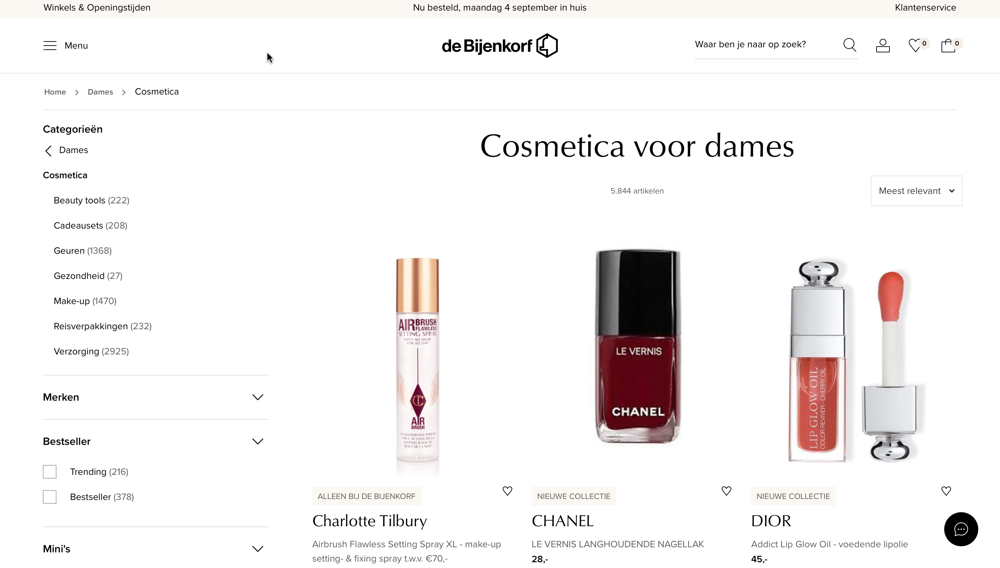
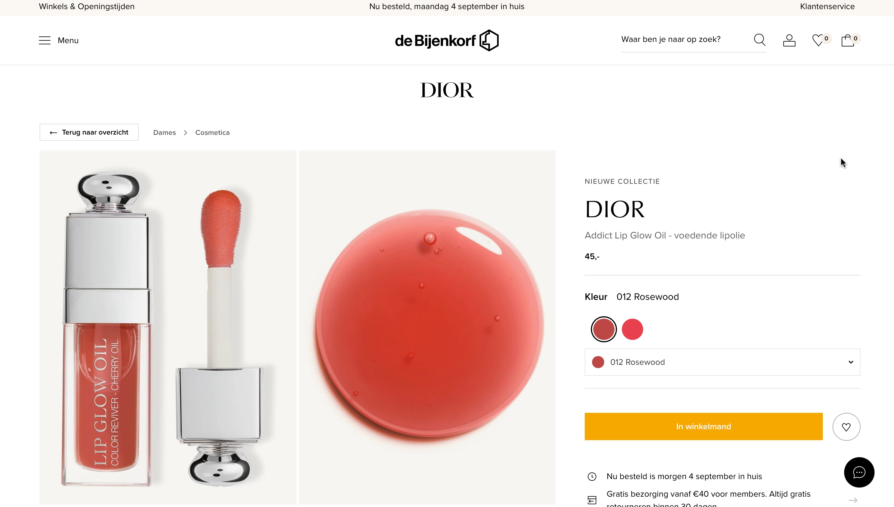

# Procesverslag
Markdown is een simpele manier om HTML te schrijven.  
Markdown cheat cheet: [Hulp bij het schrijven van Markdown](https://github.com/adam-p/markdown-here/wiki/Markdown-Cheatsheet).

Nb. De standaardstructuur en de spartaanse opmaak van de README.md zijn helemaal prima. Het gaat om de inhoud van je procesverslag. Besteedt de tijd voor pracht en praal aan je website.

Nb. Door *open* toe te voegen aan een *details* element kun je deze standaard open zetten. Fijn om dat steeds voor de relevante stuk(ken) te doen.

## Jij

  
uitwerken voor kick-off werkgroep

  ### Auteur:
  Tao Tao Douven

  #### Je startniveau:
  Blauw en als ik tijd over heb rood.

  #### Je focus:
  Ik kies voor de focus responsive.
 

## Je website

  
uitwerken voor kick-off werkgroep

  ### Je opdracht:
  https://www.debijenkorf.nl 

  #### Screenshot(s) van de eerste pagina (small screen): 
  hier de naam van de pagina  
  

  #### Screenshot(s) van de tweede pagina (small screen):
  hier de naam van de pagina  
  
 

## Toegankelijkheidstest 1/2 (week 1)

  
uitwerken na test in 2e werkgroep

  ### Bevindingen
  Lijst met je bevindingen die in de test naar voren kwamen:

  Content:
  - Bij het valideren van de html code zaten er veel fouten in de code.

  Keyboard:
  - bij het kopje keyboard had ik alles no, omdat ik nog niet met keyboard accesability bezig ben geweest.

  Mobile touch:
  - Nog niet rekening gehouden met horizontal scrolling.
  - Buttons zijn nog niet goed gesized.
  - Plaatsing van links is nog niet goed.

  Heading:
  - Was alles goed.

  List:
  - Was alles goed.

  Images:
  - Geen rekening gehouden met attribute values.

  Media:
  - Bij mij niet van toepassing, omdat mijn website geen media bevat.

  Controlls:
  - Links zijn nog niet reconisable als links.
  - Controls hebben geen :focused state.
  - Ik heb nog geen skip links.

  Appearance:
  - Ik heb geen light/dark mode.
  - High contrast mode is niet gesuport.
  - Text kan je niet tot 200% doen.

  Animation:
  - Nog niet van toepassing.

  Color contrast:
  - Bij sommige foto's is er sprake van text overlapping. 

## Breakdownschets (week 1)

  
uitwerken na afloop 3e werkgroep

  ### de hele pagina: 
  

  ### dynamisch deel (bijv menu): 
  

  ### wellicht nog een dynamisch deel (bijv filter): 
  

## Voortgang 1 (week 2)

  
uitwerken voor 1e voortgang

  ### Stand van zaken
  hier dit ging goed & dit was lastig (neem ook screenshots op van delen van je website en code)

   Ik ben in week 1 begonnen met eerst de navigatie balk te maken. Toen heb ik flexbox gebruikt om de list itemns naast elkaar en ruimte 
   tussen elkaar te plaatsen. Dat lukte eerst niet omdat ik niet de juiste parents en childrens heb aangesproken. Nadat ik dat wel 
   had gedaan is het gelukt. Het lukt mij niet om het midden stuk met alle cosmetica itemns naast elkaar in rijen te plaatsen. Ik probeerde 
   met flex de itemns goed naast en onder elkaar te krijgen, maar het lukte alleen om de binnen de itemns zelf de foto en de tekst goed onder 
   elkaar te plaatsen. 

   Ik ga nu aan de slag met grid. Ik doe display grid op de body en maak 2 columns (voor in de main bij de filter optie en de cosmetica itmens) en maak 3 rows (voor de header, 
   de filter + cosmetica itemns en de navigatie).  

  Soms werkte sommige styles die ik in de css heb aangegeven niet, maar dat kwam omdat ik de verkeerde css selector had gebruikt of 
  het verkeerde element had geselecteerd. Door itemns achtergrond kleur te geven kon ik zien hoeveel ruimte het in beslag nam en waar hij stond. 

  Door een schema te tekenen met hoe ik de grid binnen elk onderdeel wil hebben, kon ik heel makkelijk en georganiseerd itemns op de 
  juiste manier plaatsen binnen grids. 

  Ook heb ik boven elk stukje css commands gezet met waarvoor de code bedoeld is om overzicht te geven. En heb ik met commands 
  aangegeven binnen de css welke styling voor de body, header, main en footer bedoeld zijn. Dit hielp mij om code sneller terug te vinden. 

  De rows in de grid namen waaren allemaal te hoog. ik had margin: 0; en padding:0; gebruikt maar dat werkte niet. Na het opzoeken op het internet kwam ik erachter dat je hight: fit-   content; kunt gebruiken om ervoor te zorgen dat de hoogte de ruimte van de content inneemt. Nu was de header goed, maar body neemt teveel ruimte in. Door de parents een specifieke    height te geven is het gelukt. 

  De eerste pagina heeft een goed structuur en ga nu door naar begin maken van tweede pagina.

  De pagina van de index.html werkte niet meer. Ik denk dat ik komt omdat ik de footer en header allebei de klassen heb gegeven en een van de twee pagina's de verkeerde class naam      heb gebruikt. En uiteindelijk in de inspector kwamen de stijlen van de footer en header niet bij de inspector. die twee klasses bij het stijlen weg gehaalt en alles werkt. 
  Nu staat de footer bij index.html staat niet goed, maar footer diorlipoil.html wel.

  height op footer main header weg halen, kijken wat het probleem is. 

  ### Agenda voor meeting
  samen met je groepje opstellen

  | student 1      | student 2          | student 3    | student 4        |
  | ---            | ---                | ---          | ---              |
  | hoe ik mijn    | Ik ook hoe ik mijn | Hoe ik de    | feedback         |
  | navigatie goed | navigatie kan      | afbeeldingen |                  |
  | kan stylen     | stylen             | plaatsen     |                  |

  ### Verslag van meeting
  hier na afloop snel de uitkomsten van de meeting vastleggen

  - Geef foto's/elementen een achtergrond kleur want dan kan je goed zien hoe dingen staan geplaatst. 
  - Je kan grid goed gebruiken als je elementen wilt positioneren. 
  - Je kan je pagina opdelen met behulp van een grid en binnen die grid elementen weer grid van maken of bv ul's plaatsen.

## Voortgang 2 (week 3)

  
uitwerken voor 2e voortgang

  ### Stand van zaken
  hier dit ging goed & dit was lastig (neem ook screenshots op van delen van je website en code)

  Ik ga in week 3 begin nu bezig met media queries om elk verschillend grote scherm anders te stijlen. Daarna ga ik nog een nav, karosel, maken die je navigeert door de pagina heen waar je je op het moment plaats vind, met behulp van een form en input checkbox. 

In de footer staat van de tekst rijen de tweede rij niet netjes onder elkaar. Waarschijnlijk wordt hij gestyled door andere code en hierdoor heb ik hem een display:block; gegeven zodat hij wel goed staat.  

Voor het karosel, navigatie, bij de main in cosmeticapagina zijn bij de "buttons" de pijltjes als je hem in en uit klikt hetzelfde. Ik ga dat veranderen door dat als je de lijst uit klikt het pijltje naar boven wijst zodat het duidelijk word dat je hem weer terug kan klappen. Met deze video heb ik de button met een image gestijlt: https://dlo.mijnhva.nl/d2l/le/content/437009/viewContent/1483500/View 

  ### Agenda voor meeting
  samen met je groepje opstellen

  | student 1      | student 2          | student 3    | student 4        |
  | ---            | ---                | ---          | ---              |
  | Hoe ik een     | feedback           | feedback     | feedback         |
  | element goed   |                    |              |                  |
  | kan plaatsen   |                    |              |                  |

  ### Verslag van meeting
  hier na afloop snel de uitkomsten van de meeting vastleggen

  - Zorg dat je nu al ook gaat kijken naar accesability
  - 
  - 

## Toegankelijkheidstest 2/2 (week 4)

  
uitwerken na test in 9e werkgroep

  ### Bevindingen
  Lijst met je bevindingen die in de test naar voren kwamen (geef ook aan wat er verbeterd is):

  Content:
  - Er zitten geen fouten meer in de html code dus het valideren ging goed en voor alles bij content had ik een yes.

  Keyboard:
  - Ik ben mij nogsteeds niet bezig gaan houden met keyboaard accesability dus bij het kopje keyboard heb ik niet zoals bij test 1 alles no.

  Mobile touch:
  - Ook nu heb ik nog niet rekening gehouden met horizontal scrolling.
  - Buttons zijn nu tijdens test 2 wel goed gesized dus hier is deze wel yes op geantwoord.
  - Plaatsing van links is nogsteeds nog niet goed.

  Heading:
  - Was alles goed.

  List:
  - Was alles goed.

  Images:
  - Ik heb nu wel rekening gehouden met attribute values voor de images dus hier is yes op geantwoord. 

  Media:
  - Bij mij niet van toepassing, omdat mijn website geen media bevat.

  Controlls:
  - Nu zijn Links zijn nogsteeds niet reconisable als links.
  - Nu hebben controls ook geen :focused state.
  - Ik heb nogsteeds geen skip links.

  Appearance:
  - Bij test 2 heb ik ook nog geen light/dark mode.
  - High contrast mode is nu ook nog niet gesuport.
  - Text kan je weer niet tot 200% doen.

  Animation:
  - Nog niet van toepassing.

  Color contrast:
  - Er is nu nogsteeds sprake van dat sommige foto's is er sprake van text overlapping. 

## Voortgang 3 (week 4)

  
uitwerken voor 3e voortgang

  ### Stand van zaken
  hier dit ging goed & dit was lastig (neem ook screenshots op van delen van je website en code)

  ### Agenda voor meeting
  samen met je groepje opstellen

  | student 1      | student 2          | student 3    | student 4        |
  | ---            | ---                | ---          | ---              |
  | feedback       | feedback           | feedback     |  feedback        |
  |                |                    |              |                  |
  |                |                    |              |                  |

  ### Verslag van meeting
  hier na afloop snel de uitkomsten van de meeting vastleggen

  - 

## Eindgesprek (week 5)

  
uitwerken voor eindgesprek

  ### Je uitkomst - karakteristiek screenshots:
  

  ### Dit ging goed/Heb ik geleerd: 
  Korte omschrijving met plaatjes

  

  ### Dit was lastig/Is niet gelukt:
  Korte omschrijving met plaatjes

  

## Bronnenlijst

  
continu bijhouden terwijl je werkt

  Nb. Wees specifiek ('css-tricks' als bron is bijv. niet specifiek genoeg). 
  Nb. ChatGpT en andere AI horen er ook bij.
  Nb. Vermeld de bronnen ook in je code.

  1. https://dlo.mijnhva.nl/d2l/le/content/437009/viewContent/1483500/View
  2. https://css-tricks.com/exploring-the-complexities-of-width-and-height-in-css/#:~:text=Block%20elements%20include%20any%20element,%3E%20%2C%20and%20so%20many%20more.
  3. https://www.freecodecamp.org/news/media-query-css-example-max-and-min-screen-width-for-mobile-responsive-design/
  4. https://www.google.com/search?q=media+queries+not+working&client=safari&sca_esv=576523393&rls=en&biw=1470&bih=840&tbm=vid&ei=wjM5ZbHdMpvr7_UP3-2WgAk&oq=media+queries+not+wor&gs_lp=Eg1nd3Mtd2l6LXZpZGVvIhVtZWRpYSBxdWVyaWVzIG5vdCB3b3IqAggAMgUQABiABDIFEAAYgAQyBhAAGBYYHjIGEAAYFhgeMgYQABgWGB4yBhAAGBYYHjIGEAAYFhgeMgYQABgWGB4yBhAAGBYYHjIGEAAYFhgeSMcQUABYsglwAHgAkAEAmAFMoAGbBKoBATi4AQHIAQD4AQGIBgE&sclient=gws-wiz-video#fpstate=ive&vld=cid:a28c8451,vid:acqN6atXVAE,st:0.
  5. https://www.geeksforgeeks.org/how-to-use-before-or-after-pseudo-element-to-an-input-field-in-css/#:~:text=Note%3A%20We%20cannot%20use%20%3A%3A,style%20to%20each%20of%20them.
  6. https://dev.to/erhannah/adding-pseudoelements-on-input-elements-5bdk
  7. https://css-tricks.com/snippets/css/a-guide-to-flexbox/.

